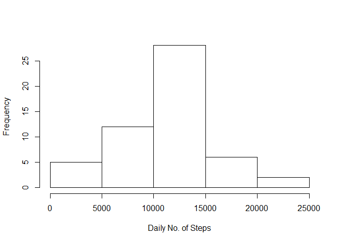
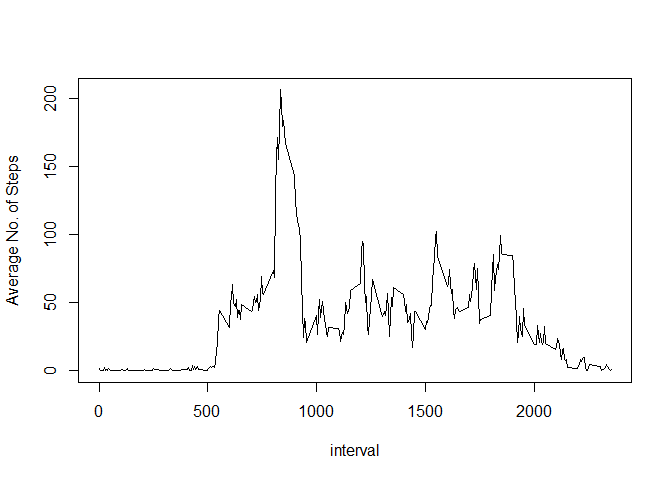
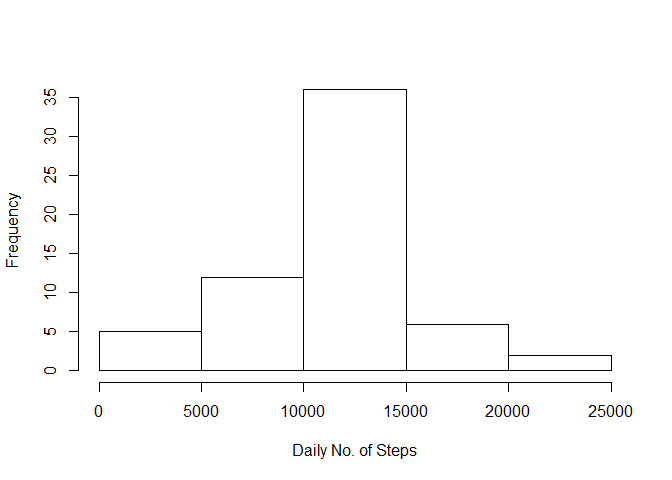
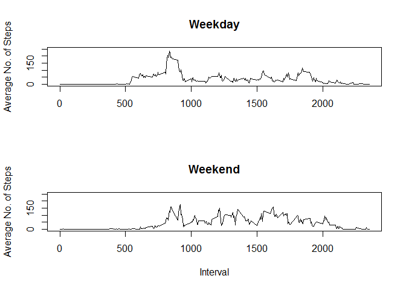

# Peer-reviewed Assignment 1


## Loading and preprocessing the data

```r
url <- "https://d396qusza40orc.cloudfront.net/repdata%2Fdata%2Factivity.zip"
download.file(url, "activity.zip")
unzip("activity.zip")
```


```r
df <- read.csv("activity.csv")
```

## What is mean total number of steps taken per day?

The following code calculates returns the mean and median total number of steps taken per day. 


```r
library(dplyr)
df2 <- df %>% group_by(date) %>% summarize(dailySum = sum(steps, na.rm=FALSE))

meanStep <- mean(df2$dailySum, na.rm=TRUE)
medianStep <- median(df2$dailySum, na.rm=TRUE)

paste("The mean no. of step taken per day is:", round(meanStep), sep=" ")
```

```
## [1] "The mean no. of step taken per day is: 10766"
```

```r
paste("The median no. of step taken per day is:", round(medianStep), sep=" ")
```

```
## [1] "The median no. of step taken per day is: 10765"
```

The following code produces a histogram of the daily sum of steps taken.


```r
hist(df2$dailySum, xlab="Daily No. of Steps", main="")
```

<!-- -->

## What is the average daily activity pattern?

The following code produces and plots the averge number of steps taken at each time interval.


```r
df3 <- df %>% group_by(interval) %>% summarize(avg = mean(steps,na.rm=TRUE))
with(df3, plot(interval, avg, xlab="interval", ylab="Average No. of Steps", type = "l"))
```

<!-- -->

The following code determines the time interval with the highest number of steps.


```r
maxAvg<- max(df3$avg)
maxInt <- df3$interval[df3$avg==maxAvg]

paste("The interval with the max. no. of step is:", maxInt, sep =" ")
```

```
## [1] "The interval with the max. no. of step is: 835"
```

## Imputing missing values

In the dataset, there are a few days with the values of steps missing, represented as "NA". The missing values are replaced by the mean values of steps calculated from other days. 


```r
meanInt <- df %>% group_by(interval) %>% summarize(avg = mean(steps, na.rm=TRUE))
df4 <- df
for (i in 1:nrow(df4)) {
  if (is.na(df4$steps[i])) {
    df4$steps[i] <- meanInt$avg[meanInt$interval==df4$interval[i]]
  }
}

df41 <- df4 %>% group_by(date) %>% summarize(sumDaily= sum(steps,na.rm=TRUE))

mean2 <- mean(df41$sumDaily, na.rm=TRUE)
median2 <- median(df41$sumDaily, na.rm=TRUE)

hist(df41$sumDaily, xlab="Daily No. of Steps", main="")
```

<!-- -->


```r
meanStep2 <- mean(df41$sumDaily, na.rm=TRUE)
medianStep2 <- median(df41$sumDaily, na.rm=TRUE)
paste("The mean no. of step taken per day is:", round(meanStep2), sep=" ")
```

```
## [1] "The mean no. of step taken per day is: 10766"
```

```r
paste("The median no. of step taken per day is:", round(medianStep2), sep=" ")
```

```
## [1] "The median no. of step taken per day is: 10766"
```


```r
compare <- data.frame(Original=c(meanStep,medianStep), Modified=c(meanStep2,medianStep2),row.names=c("Mean","Median"))
compare
```

```
##        Original Modified
## Mean   10766.19 10766.19
## Median 10765.00 10766.19
```

The mean and median values of the modified dataset are very close or equal to that of the unmodified data set.

## Are there differences in activity patterns between weekdays and weekends?


```r
df5 <- df %>% mutate(dayofweek = weekdays(as.Date(as.character(date)))) %>% mutate(weekday = ifelse(dayofweek == "Saturday"|dayofweek=="Sunday", "No", "Yes"))
df51 <- df5 %>% group_by(weekday, interval) %>% summarize(avg = mean(steps,na.rm=TRUE))

weekday <- df51[df51$weekday=="Yes",]
weekend <- df51[df51$weekday=="No",]

par(mfrow=c(2,1))
with(weekday, plot(interval,avg, xlab="", ylab="Average No. of Steps", ylim=c(0,250),main="Weekday", type ="l"))
with(weekend, plot(interval,avg, xlab="Interval", ylab="Average No. of Steps", ylim=c(0,250), main="Weekend", type="l"))
```

<!-- -->
